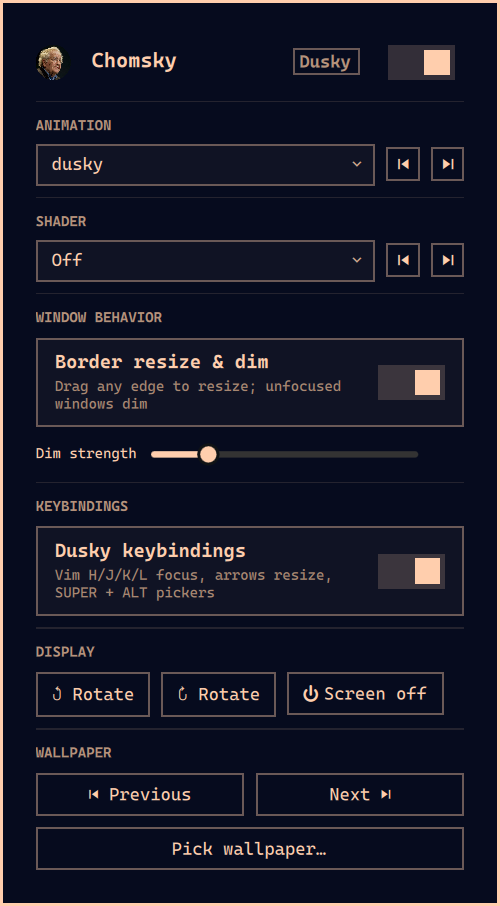

# Chomsky

A single Omarchy plugin that manages a [Dusky](https://github.com/dusklinux/dusky)-derived
look & feel: 12 Hyprland animation presets, 17 screen shaders, border-resize
and inactive-window dimming, monitor rotation, DPMS, wallpaper cycling across
the active theme and your own `~/Pictures`, and a switch between Omarchy's
keybindings and Dusky's. Everything is bundled -- no edits to your own
`~/.config/hypr/*.lua` files required.

It is built to be driven from the **Omarchy menu** rather than from the bar, so
the bar chip is optional: `bin/chomsky-bar off` takes it off the bar and leaves
the plugin, its menu rows and its startup service running.



## Install

```bash
omarchy plugin add https://github.com/alhasapi/omarchy-chomsky.git --enable --yes
```

Or by hand:

```bash
git clone https://github.com/alhasapi/omarchy-chomsky.git \
  ~/.config/omarchy/plugins/alhasapi.chomsky
omarchy-shell shell rescanPlugins
omarchy plugin enable alhasapi.chomsky
```

## What it does

| Section | What it does |
|---|---|
| **Animation** | Switch or cycle through 12 Dusky animation presets (dusky, bounce, fade, mechanical, slowmotion, disable, …) |
| **Shader** | Switch or cycle through 17 GLSL screen shaders (tints, grayscale, vignette, chromatic aberration, …), or turn them off |
| **Window behavior** | Toggle border/gap resize with the bare cursor (no modifier) plus inactive-window dimming, with a strength slider |
| **Keybindings** | Switch between Omarchy's shipped bindings and the Dusky port (see below) |
| **Display** | Rotate the focused monitor 90° either way; DPMS screen off |
| **Wallpaper** | Cycle to the previous/next background across the active theme and `~/Pictures`, or pick one from a thumbnail grid |

Every one of those is available three ways: from the Omarchy menu (each gets its
own row under **Style**), from the panel behind the bar chip, and from the CLIs
in `bin/`. The panel is the mouse-friendly view -- animation/shader dropdowns,
the dim-strength slider, the keybinding toggle. With the chip on the bar, the
chip's ring lights up (accent color) while a shader is active, and its tooltip
shows the current animation, shader, theme and keybinding mode.

## Running without the bar chip

The menu is the primary surface, so the chip is optional:

```bash
~/.config/omarchy/plugins/alhasapi.chomsky/bin/chomsky-bar off   # free the space
~/.config/omarchy/plugins/alhasapi.chomsky/bin/chomsky-bar on    # put it back
```

`off` moves the widget's entry out of `bar.layout` and into shell.json's
top-level `plugins` array, which is what keeps the plugin enabled. Deleting the
entry from the bar by hand instead switches the whole plugin off: a third-party
bar widget counts as enabled only while it is either placed in the bar or listed
in `plugins` (see `PluginRegistry.findEntryLocation`). `off` writes the file
atomically, validates it first, and leaves a timestamped
`shell.json.bak.<epoch>` beside it.

With the chip off the bar, the Omarchy menu rows, the shader restoring itself at
login, the wallpaper cycling and the keybinding switch all keep working -- the
menu's own "Chomsky panel" row hides itself, since there is no chip to anchor a
panel to. `chomsky-bar status` says which mode you are in.

## Keybindings: Dusky or Omarchy

Style > **Keybindings** in the menu (or the panel's toggle) switches Hyprland
between Omarchy's shipped bindings and the Dusky port:

| | |
|---|---|
| **Dusky** | `SUPER + H/J/K/L` vim focus, `SUPER + SHIFT + H/J` swap, arrows resize (repeating), `SUPER + ALT + A` animation picker, `SUPER + ALT + X` shader picker, `CTRL + ALT + R`/`+SHIFT` rotate, `ALT + F7`/`F8` DPMS, `SUPER + SHIFT + R` reload, `SUPER + SHIFT + ESCAPE` click-to-kill, `SUPER + apostrophe` next wallpaper, `SUPER + SHIFT + apostrophe` pick wallpaper |
| **Omarchy** | The shipped defaults, including the seven bindings Dusky takes over: `SUPER + J` split, `SUPER + K` keybindings, `SUPER + L` workspace layout, `SUPER + arrow` focus |

The three Omarchy bindings the vim keys displace move rather than disappear:
split → `SUPER + Y`, keybindings → `SUPER + SHIFT + K`, workspace layout →
`SUPER + SHIFT + L`. In Omarchy mode the seven displaced defaults are bound
again and the rest of the Dusky keys are left unbound, so "Omarchy" mode really
is Omarchy's set and not Omarchy's plus extras.

```bash
bin/chomsky-keys            # print the mode in force
bin/chomsky-keys dusky
bin/chomsky-keys omarchy
bin/chomsky-keys toggle
bin/chomsky-keys keys       # list every key the switch touches
bin/chomsky-keys reset      # drop the switch; leave your config in charge
```

The switch is one generated file in Omarchy's own toggle-flag directory
(`~/.local/state/omarchy/toggles/hypr/chomsky-keys.lua`), which
`default/hypr/toggles.lua` sources last on every `hyprctl reload` -- after
Omarchy's defaults *and* after your own `~/.config/hypr/bindings.lua`. Loading
last is what lets one mode win over the other without editing either, and what
makes it a reload rather than a logout. The binding sets themselves live in
`keys/chomsky_keys.lua`; the seven Omarchy defaults it restores are copied from
`$OMARCHY_PATH/default/hypr/bindings/`, and `hyprctl binds -j` shows what is
live.

Nothing is touched until you switch for the first time: with no toggle file
there are no Chomsky bindings at all. If you had already ported some Dusky
bindings into your own `~/.config/hypr/bindings.lua`, you can leave them -- the
toggle loads last and wins in both directions -- or delete that section, since
the plugin now owns those keys.

## Omarchy menu rows

The plugin adds its own rows under **Style**, so everything above is reachable
from the keyboard-driven menu even when the bar is hidden or the chip is off:

```
Style
├── Animation                     animation picker; ✓ unless the preset is `disable`
├── Shader
│   ├── Pick shader...            (alias: `shader`)
│   ├── Next shader / Previous shader
│   └── Turn off shader           hidden when no shader is active
├── Window Behavior               ✓ when border resize & dimming is on
│   ├── Toggle border resize & dim
│   └── Set dim strength...
├── Keybindings                  ✓ when the Dusky set is on
│   ├── Dusky keybindings        ✓ when active
│   ├── Omarchy keybindings      ✓ when active
│   └── Show current keybindings
├── Display Controls
│   ├── Rotate 90° Clockwise / Counter-Clockwise
│   └── Turn screen off (DPMS)
├── Wallpaper
│   ├── Previous background / Next background
│   └── Pick wallpaper...         thumbnail grid, active one highlighted
└── Chomsky panel                 only while a chip is on the bar (alias: `chomsky`)
```

They are installed on shell start, as one marker-delimited block in
`~/.config/omarchy/extensions/omarchy-menu.jsonc` -- the file Omarchy provides
for exactly this. Turn them off (and keep them off) with either:

```bash
bin/chomsky-menu-install --remove                 # from a terminal
omarchy bar set alhasapi.chomsky menuRows false --json   # the widget setting
```

`bin/chomsky-menu-install --enable` brings them back; `--help` explains the
rest. The choice is saved in `~/.local/state/chomsky/menu-rows`, so it survives
the chip being taken off the bar, plugin updates and restarts.

The rows keep working while the plugin is disabled or the chip is off the bar;
they only stop once the plugin directory is deleted, at which point clicking one
cleans the stale block out of the menu and says so.

## How it stays out of your config

Animation presets and the window-behavior toggle are applied by writing to
Omarchy's own toggle-flag directory
(`~/.local/state/omarchy/toggles/hypr/chomsky-*.lua`), which
`default/hypr/toggles.lua` sources on every `hyprctl reload` -- after your own
`looknfeel.lua`, so it always wins, with no `require()` line needed anywhere.
The keybinding switch uses the same directory. Shaders, animation, the
menu-rows choice and the wallpaper/keybinding mode are recorded in
`~/.local/state/chomsky/`.

Two files outside the plugin directory, both reversible:

- `~/.config/omarchy/extensions/omarchy-menu.jsonc` -- the plugin's rows, in
  their own marker-delimited block, only while they are switched on.
- `~/.config/omarchy/shell.json` -- only if you use `chomsky-bar off|on`, which
  moves the chip's entry between `bar.layout` and `plugins`.

Worth knowing:

- That toggle-flag directory is Omarchy-managed **state**, not user config --
  an Omarchy update or migration could in principle clear it, which would
  silently revert the animation preset, window-behavior toggle and keybinding
  mode to Omarchy's defaults until you change them again. Nothing load-bearing
  lives there.
- `bin/chomsky-window`'s "on" state writes the *complete* Dusky-style config
  (border grab area, hover cursor, dim strength/special/around/modal, drag
  animation) rather than a diff, so it behaves the same on a machine that has
  never touched `looknfeel.lua`.

## CLIs

Each action is backed by a standalone script in `bin/`, usable from a terminal
or your own keybinds:

```
bin/chomsky-anim    {list,set <name>,current,next,prev,off,menu}
bin/chomsky-shader  {list,set <name>,off,toggle,current,next,prev,restore,menu}
bin/chomsky-window  {on [dim],off,toggle [dim],current}
bin/chomsky-keys    {dusky,omarchy,toggle,current,keys,reset}
bin/chomsky-monitor-rotate {cw,ccw}
bin/chomsky-wallpaper {list,current,next,prev,set <path>,menu}
bin/chomsky-bar     {on,off,status}
bin/chomsky-menu-install [--enable|--remove]
```

`bin/chomsky` is the single entry point the QML calls, so the panel only ever
depends on that one script. `bin/chomsky-menu-entry` is the row-action
dispatcher that `chomsky-menu-install` copies into
`~/.config/omarchy/extensions/` for the menu rows to call.

`bin/chomsky-link` regenerates thin `~/.local/bin/omarchy-*` wrappers onto the
animation, shader, rotation and wallpaper CLIs, if you want them on `PATH` under
those names -- handy for keybinds. Safe to re-run any time.

## Not covered

Per-app window-sizing and floating rules from the original Dusky port are
config-file territory (window rules in a `.lua` file), not something a plugin
should own -- add them to your own `~/.config/hypr/windows.lua` if you want
them. Click-to-kill *is* covered: it is part of the Dusky keybinding set.

The pre-2.0 `theme-from-wallpaper` feature (generate a whole Omarchy theme from
an image with `matugen`) was dropped: Omarchy's own `Style > Theme` covers theme
switching, and this plugin now only cycles and picks backgrounds. It is still in
git history if you want it back.

## License

MIT (see `LICENSE`). Animation presets and shaders ported from Dusky (MIT);
the bundled portrait icon is CC BY-SA 2.0. See `NOTICE`.
